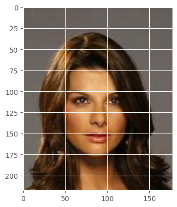
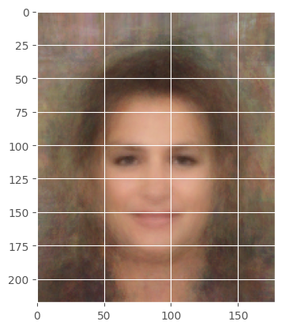
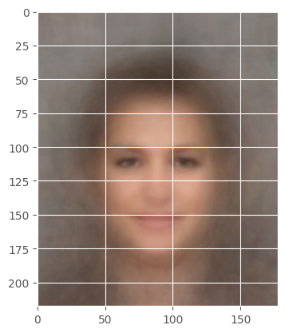
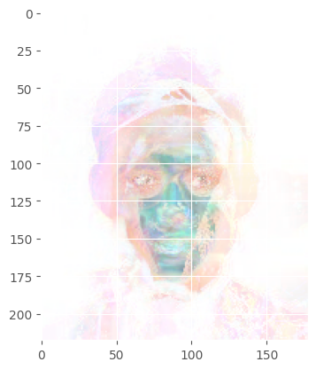

   # Transformation of image dataset(Practise)
    

### ggplot style sheet
https://matplotlib.org/stable/gallery/style_sheets/ggplot.html


```python
%matplotlib inline
import numpy as np
import matplotlib.pyplot as plt
plt.style.use('ggplot')
```


```python
# Load the os library
import os

# Load the request module
import urllib.request

# Import SSL which we need to setup for talking to the HTTPS server
import ssl
ssl._create_default_https_context = ssl._create_unverified_context

# Create a directory
try: 
    os.mkdir('img_align_celeba')

    # Now perform the following 100 times:
    for img_i in range(1, 101):

        # create a string using the current loop counter
        f = '000%03d.jpg' % img_i

        # and get the url with that string appended the end
        url = 'https://s3.amazonaws.com/cadl/celeb-align/' + f

        # We'll print this out to the console so we can see how far we've gone
        print(url, end='\r')

        # And now download the url to a location inside our new directory
        urllib.request.urlretrieve(url, os.path.join('img_align_celeba', f))
except:
    #os.rm('img_align_celeba')
    print("You may need to delete the existing 'img_align_celeba' folder in your directory")
```

    You may need to delete the existing 'img_align_celeba' folder in your directory


```python
files = os.listdir('img_align_celeba')# img.<tab>
import matplotlib.pyplot as plt
import numpy as np

print(os.path.join('img_align_celeba', files[0]))
plt.imread(os.path.join('img_align_celeba', files[0]))

files = [os.path.join('img_align_celeba', file_i)
 for file_i in os.listdir('img_align_celeba')
 if '.jpg' in file_i]

# There should be 100 files, with the last one being number 99

#img = plt.imread(files[99])
#print(img)

imgs = [plt.imread(files[file_i])
        for file_i in range(100)]
plt.imshow(imgs[10])
```

    img_align_celeba/000026.jpg


    <matplotlib.image.AxesImage at 0x123de1fd0>


    

    


#### NumPy Array Shape
The shape of an array is the number of elements in each dimension.

https://www.w3schools.com/python/numpy/numpy_array_shape.asp

returns a tuple with each index having the number of corresponding elements

#### NumPy Array Reshaping

https://www.w3schools.com/python/numpy/numpy_array_reshape.asp

Reshaping means changing the shape of an array


```python
#imgs[0] is numpy.ndarray
imgs[0].shape
```


    (218, 178, 3)


```python
data = np.array(imgs) # make 'data' = our numpy array
data.shape
print(data.shape)

```

    (100, 218, 178, 3)


#### numpy.nanmedian
https://numpy.org/doc/stable/reference/generated/numpy.nanmedian.html


```python
nanmedian_img = np.nanmedian(data, axis=0) # This is the mean of the 'batch' channel
plt.imshow(nanmedian_img.astype(np.uint8))
```


    <matplotlib.image.AxesImage at 0x123e848b0>


    

    


#### numpy.average
https://numpy.org/doc/stable/reference/generated/numpy.average.html


```python
average_img = np.average(data, axis=0) # This is the mean of the 'batch' channel
plt.imshow(average_img.astype(np.uint8))
```


    <matplotlib.image.AxesImage at 0x123ebe8b0>


    

    


#### numpy.ptp
https://numpy.org/doc/stable/reference/generated/numpy.ptp.html


```python
ptp_img = np.ptp(data, axis=0) # This is the mean of the 'batch' channel
plt.imshow(ptp_img.astype(np.uint8))
```


    <matplotlib.image.AxesImage at 0x123f840d0>


    

    


```python

```
