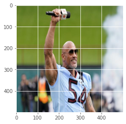

# Web scraper(practise02)

# python parse

https://pythonspot.com/http-parse-html-and-xhtml/

## Beautiful Soup - a python package for parsing HTML and XML


```python
%matplotlib inline
import numpy as np
import matplotlib.pyplot as plt
plt.style.use('ggplot')
```


```python
import requests
from bs4 import BeautifulSoup
import os
import PIL
from PIL import Image

url = "https://www.vogue.co.uk/"
response = requests.get(url)

soup = BeautifulSoup(response.content, 'html.parser')
images = soup.find_all('img')

# Create a directory to store the images
if not os.path.exists('images'):
    os.makedirs('images')

# Download and save the images
for img in images:
    img_url = img['src']
    filename = img['alt']
    try:
        img = requests.get(img_url).content
        with open(f'images/{filename}.jpg', 'wb') as handler:
        #with open(f'images/{img_url}.jpg', 'wb') as handler:
            handler.write(img)
    except:
        print(f"Failed {filename}")

```

    Failed British Vogue
    Failed Profile
    Failed British Vogue
    Failed Profile
    Failed Vogue


```python
files = os.listdir('images')# img.<tab>
import matplotlib.pyplot as plt
import numpy as np

print(os.path.join('images', files[0]))
plt.imread(os.path.join('images', files[0]))

files = [os.path.join('images', file_i)
 for file_i in os.listdir('images')
 if '.jpg' in file_i]

img = plt.imread(files[1])

print(img)

```

    images/British Vogue  Fashion Trends Latest News Catwalk Photos  Designers.jpg
    [[[109 118  63]
      [108 117  62]
      [106 115  60]
      ...
      [ 79  83  86]
      [ 81  85  88]
      [ 69  73  76]]
    
     [[104 113  58]
      [105 114  59]
      [107 116  61]
      ...
      [ 84  88  91]
      [ 84  88  91]
      [ 70  74  77]]
    
     [[106 117  61]
      [106 117  61]
      [109 118  63]
      ...
      [ 85  88  93]
      [ 85  88  93]
      [ 72  75  80]]
    
     ...
    
     [[  3   3   5]
      [  0   0   2]
      [  3   3   3]
      ...
      [ 88 102  89]
      [ 87 101  88]
      [ 81  95  82]]
    
     [[  4   4   6]
      [  0   0   2]
      [  4   4   4]
      ...
      [ 86 100  87]
      [ 85  99  86]
      [ 80  94  81]]
    
     [[  5   5   7]
      [  1   1   3]
      [  6   6   6]
      ...
      [ 85  99  86]
      [ 84  98  85]
      [ 79  93  80]]]


```python
plt.imshow(img)
```


    <matplotlib.image.AxesImage at 0x12de7e3d0>


    

    


```python
plt.imshow(img[:, :, 0], cmap='gray')
```


    ---------------------------------------------------------------------------

    TypeError                                 Traceback (most recent call last)

    Cell In[78], line 1
    ----> 1 plt.imshow(img[:, :, 0], cmap='gray')


    TypeError: 'Image' object is not subscriptable


## Resize the pictures


```python
f = r'images'
os.listdir(f)
for file in os.listdir(f):
    f_img = f+"/"+file
    img = Image.open(f_img)
    img = img.resize((500,500))
    img.save(f_img)
```


```python
imgs = [plt.imread(files[file_i])
        for file_i in range(10)]
```


```python
plt.imshow(imgs[9])
```


    <matplotlib.image.AxesImage at 0x12dafa130>


    

    


```python
imgs[0].shape
imgs[1].shape
```


    (500, 500, 3)


```python
data = np.array(imgs) # make 'data' = our numpy array
data.shape
print(data.shape)
```

    (10, 500, 500, 3)


```python
mean_img = np.mean(data, axis=0) # This is the mean of the 'batch' channel
plt.imshow(mean_img.astype(np.uint8))
print("look at this average person")
```

    look at this average person


    

    


```python
std_img = np.std(data, axis=0) # This is the mean of the 'batch' channel
plt.imshow(std_img.astype(np.uint8))
print("look at this average person")
```

    look at this average person


    

    


```python
plt.imshow(np.mean(std_img, axis=2).astype(np.uint8))
```


    <matplotlib.image.AxesImage at 0x12fbc9040>


    

    


```python

```
